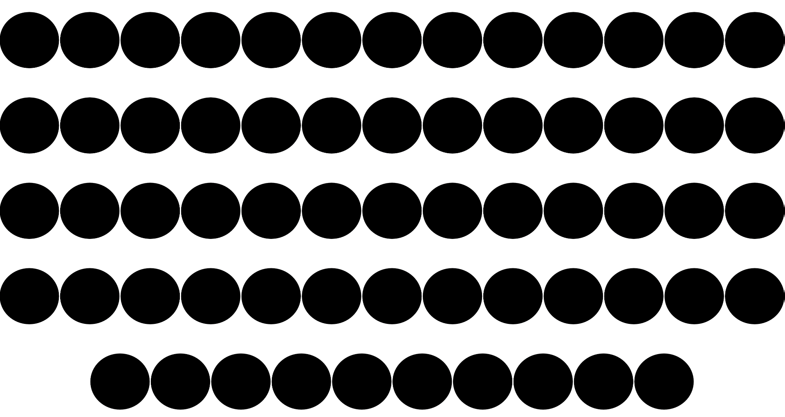

# Asterisk privacy font
A font where every letter is a circle. Use it to hide sensitive information in interfaces by simply changing the font of the text. It's available here as OFT and SVG font file.



I consider it to be in the public domain.

You can edit and expand the font by using Glyphr Studio, an online font creation tool. Open the project file at:

https://www.glyphrstudio.com/online/


```
@font-face {
    font-family: 'Privacy';
    src: url('Asterisk-Regular.otf') format('opentype');
    font-weight: normal;
    font-style: normal;
}

.hidden-text{
    font-family: 'Privacy', sans-serif;
}
```
